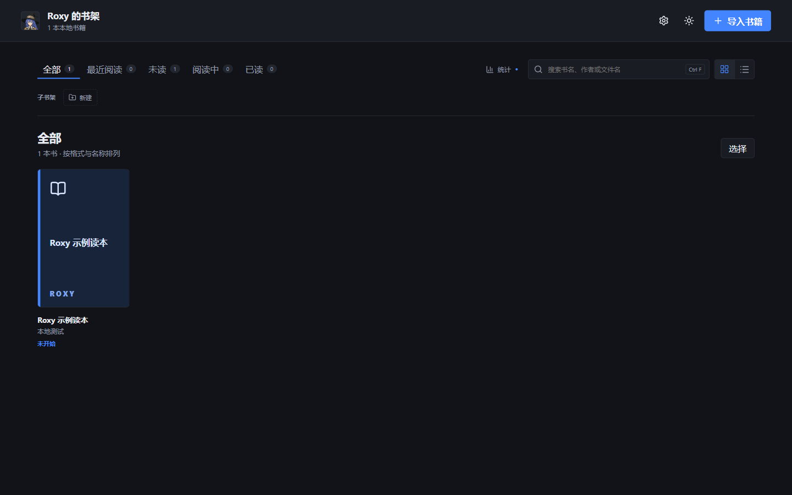
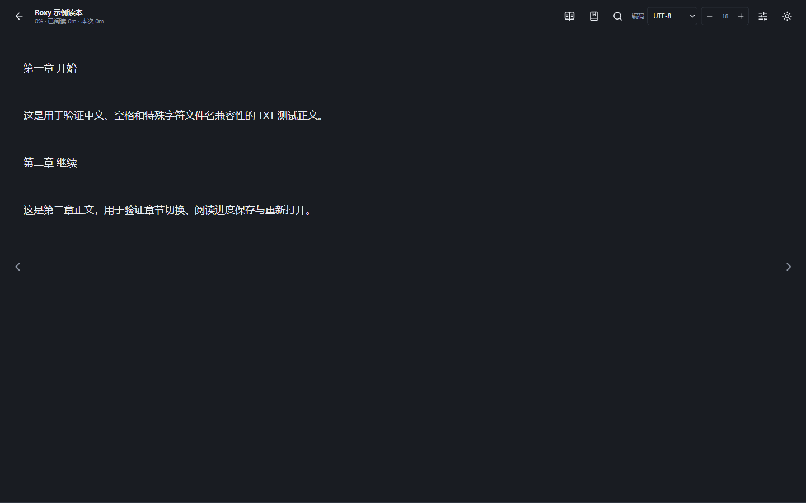
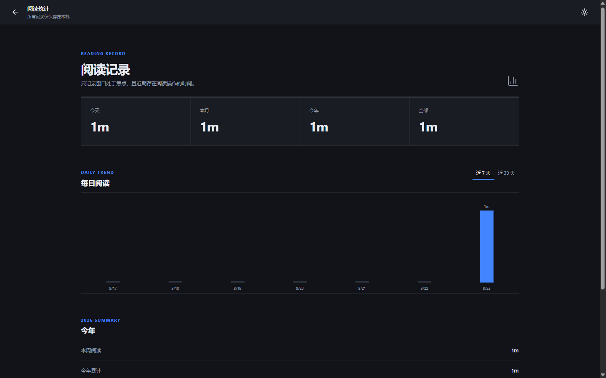

<p align="center">
  
</p>

<h1 align="center">Roxy Bookshelf</h1>

<p align="center">
  A quiet, local-first EPUB, TXT and PDF reader for Windows.
  <br>
  Your books and reading data stay on your computer.
</p>

<p align="center">
  <strong>EPUB</strong> · <strong>TXT</strong> · <strong>PDF</strong> · Offline · No account · No telemetry
</p>

<p align="center">
  <a href="https://github.com/rudeus5128-art/roxy-bookshelf/actions/workflows/ci.yml"></a>
  
  
</p>

<p align="center">
  <strong><a href="https://github.com/rudeus5128-art/roxy-bookshelf/releases/latest">Download the latest release</a></strong>
  ·
  <a href="./README.md">中文</a>
</p>



## A reader that stays out of the way

Roxy Bookshelf focuses on stable, safe and fast local reading instead of feature overload. It is built for a private Windows library and keeps the interface restrained so the book remains the focus.

## Highlights

- Local EPUB, TXT and PDF reading
- Library search, custom shelves and batch organization
- Table of contents, in-book search, bookmarks and highlights
- Reliable reading-position restore for every format
- TXT encoding detection with UTF-8, UTF-16, GBK and GB18030 support
- Continuous, single-page and two-page PDF modes with zoom and page fitting
- Adaptive single-page and two-page EPUB/TXT layouts for fullscreen and windowed reading
- Local reading statistics based on real reading activity
- Complete light and dark themes
- Windows file associations for opening books directly from File Explorer

## EPUB, TXT and PDF

<table>
  <tr>
    <td align="center" width="33%"></td>
    <td align="center" width="33%"></td>
    <td align="center" width="33%"></td>
  </tr>
  <tr>
    <td align="center"><strong>EPUB</strong><br>Covers, contents, illustrations, search and adaptive page layouts</td>
    <td align="center"><strong>TXT</strong><br>Encoding detection, chapter recognition and large-file reading</td>
    <td align="center"><strong>PDF</strong><br>Scrolling, single/two-page modes, contents, search and zoom</td>
  </tr>
</table>

After file associations are enabled during installation, `.epub`, `.txt` and `.pdf` files use the corresponding icons shown above in Windows File Explorer.

## Reading and statistics



Reading time is counted only while the reader is in front, the window has focus and recent page turns, scrolling, chapter navigation or other reading activity is detected. All records remain local.



## Privacy and file safety

- Core reading works completely offline
- No account, telemetry or hidden upload
- Book contents, filenames, reading history and statistics stay local
- Original EPUB, TXT and PDF files are never modified

## Download and Windows SmartScreen

Download the installer from the [latest release](https://github.com/rudeus5128-art/roxy-bookshelf/releases/latest).

Roxy is an independent open-source project and its Windows installer is currently unsigned. Microsoft Edge or Windows SmartScreen may therefore show an unknown-publisher or uncommon-download warning. Each release includes a SHA-256 checksum so you can verify the downloaded installer.

```powershell
Get-FileHash -Algorithm SHA256 .\Roxy-Bookshelf-1.0.1-Setup.exe
```

## Development

Requirements: Windows 10/11, Node.js 20 or later, and npm.

```powershell
npm install
npm run typecheck
npm test
npm run build
npm run package:win
```

Built with Electron, React, TypeScript, epub.js, PDF.js and sql.js.

## License and visual assets

The program source code is available under the [MIT License](./LICENSE). Third-party character artwork, illustrations, icons, reference images and related visual assets in this repository are explicitly excluded from the MIT grant and are not offered under an open-content license. See [THIRD_PARTY_ASSETS.md](./THIRD_PARTY_ASSETS.md) for details.
