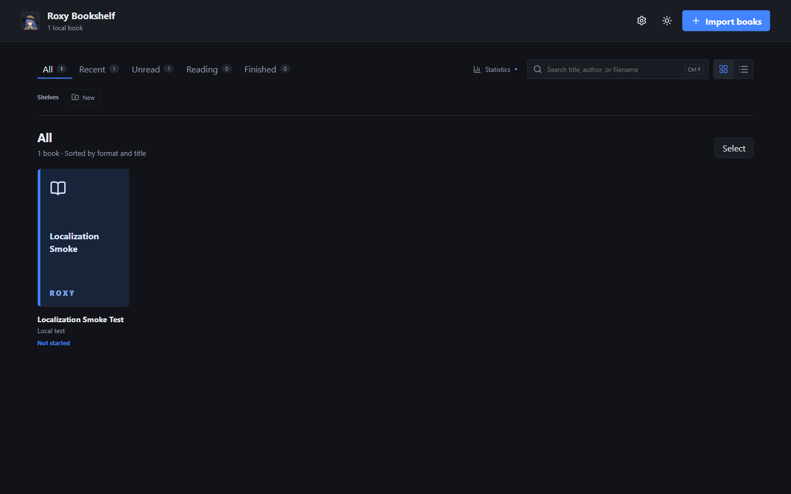
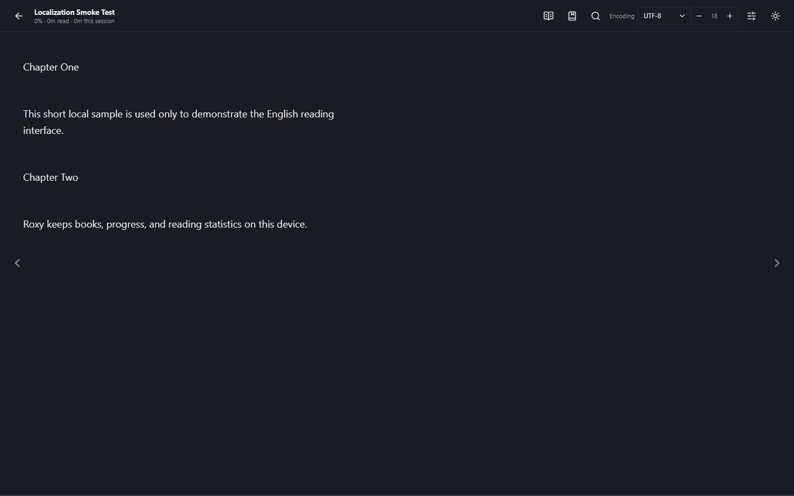
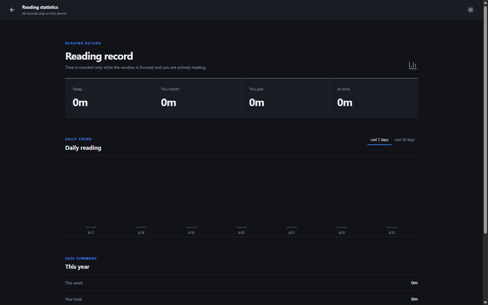

<p align="center">
  
</p>

<h1 align="center">Roxy Bookshelf</h1>

<p align="center">
  A quiet, local-first EPUB, TXT, and PDF reader for Windows.
  <br>
  Your books, reading progress, annotations, and statistics stay on your computer.
</p>

<p align="center">
  <a href="./README.md"><strong>English</strong></a> | <a href="./README.zh-CN.md">简体中文</a>
</p>

<p align="center">
  <a href="https://github.com/rudeus5128-art/roxy-bookshelf/actions/workflows/ci.yml"></a>
  
  
</p>

<p align="center">
  <strong><a href="https://github.com/rudeus5128-art/roxy-bookshelf/releases/latest">Download the latest Windows release</a></strong>
</p>



## About

Roxy Bookshelf is a restrained desktop reader for people who keep their own ebook files. It focuses on fast access to local books, dependable reading-position recovery, and an interface that stays out of the way.

Core reading works offline. Roxy has no account system, advertising, recommendation feed, telemetry, or cloud dependency, and it does not modify the original EPUB, TXT, or PDF files.

## Features

- Local EPUB, TXT, and PDF library
- English (`en-US`) and Simplified Chinese (`zh-CN`) interface
- Grid and list views, instant library search, reading-status filters, and recent reading
- Custom color-coded shelves with drag-and-drop and batch organization
- Contents, in-book search, bookmarks, highlights, and highlight erasing
- Reliable reading-position restoration for all three formats
- Adaptive one-page and two-page EPUB/TXT layouts for fullscreen and windowed reading
- Local reading statistics based on active reading interaction rather than app-open time
- Complete light and dark themes
- Windows file associations for opening books directly from File Explorer

## Supported formats

<table>
  <tr>
    <td align="center" width="33%"></td>
    <td align="center" width="33%"></td>
    <td align="center" width="33%"></td>
  </tr>
  <tr>
    <td align="center"><strong>EPUB</strong><br>Covers, contents, illustrations, search, adaptive pages, and reading themes</td>
    <td align="center"><strong>TXT</strong><br>UTF-8, UTF-16, GBK, GB18030, chapter detection, and large-file indexing</td>
    <td align="center"><strong>PDF</strong><br>Continuous, one-page, and two-page modes, contents, search, zoom, and page fitting</td>
  </tr>
</table>

After file associations are enabled during installation, Windows File Explorer uses the format-specific icons shown above for `.epub`, `.txt`, and `.pdf` files.

## Screenshots

### Reading



### Local reading statistics



Reading time is counted only while the reader is in front, the window has focus, and recent reading activity such as scrolling or page navigation has occurred.

## Installation

1. Open the [latest GitHub Release](https://github.com/rudeus5128-art/roxy-bookshelf/releases/latest).
2. Download `Roxy-Bookshelf-1.0.2-Setup.exe`.
3. Optionally compare its SHA-256 digest with the checksum published in the release.
4. Run the installer and choose an installation directory.

Roxy is currently an unsigned independent open-source application. Microsoft Edge or Windows SmartScreen may show an uncommon-download or unknown-publisher warning. This indicates that the executable has not accumulated signed reputation; it is not, by itself, a malware detection. Only download Roxy from this repository and verify the release checksum.

```powershell
Get-FileHash -Algorithm SHA256 .\Roxy-Bookshelf-1.0.2-Setup.exe
```

## System requirements

- Windows 10 or Windows 11, 64-bit
- A modern laptop or desktop display; layouts adapt between windowed and fullscreen use
- No network connection is required for core reading

## Build from source

Requirements: Windows 10/11, Node.js 20 or later, and npm.

```powershell
git clone https://github.com/rudeus5128-art/roxy-bookshelf.git
cd roxy-bookshelf
npm install
npm run typecheck
npm test
npm run build
npm run package:win
```

The production NSIS installer is written to `release/`.

Roxy is built with Electron, React, TypeScript, epub.js, PDF.js, and sql.js.

## Privacy and file safety

- Original EPUB, TXT, and PDF files are read-only to Roxy
- Metadata overrides, progress, shelves, annotations, and statistics are stored in the local application database
- No book content, filename, reading record, or statistic is uploaded
- Uninstalling Roxy does not delete the user’s original ebook folders

## Known limitations

- Windows only; macOS and Linux packages are not provided
- The installer is not code-signed and may trigger Windows SmartScreen
- PDF text search and highlighting depend on the PDF containing a usable text layer
- DRM-protected or password-protected books are not supported
- EPUB compatibility can still vary with malformed or non-standard publications

## License

Program source code that this project has the right to license is available under the [MIT License](./LICENSE).

Third-party character artwork, illustrations, icons, reference images, and related visual materials in this repository are explicitly excluded from the MIT grant. They are not automatically available under MIT, CC0, CC BY, or another open-content license. Rights in third-party characters, names, artwork, and other intellectual property remain with their respective owners. See [THIRD_PARTY_ASSETS.md](./THIRD_PARTY_ASSETS.md).

## Credits

tai and codex
